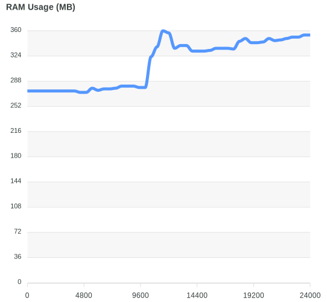
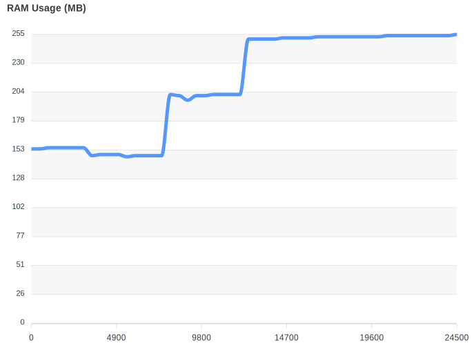
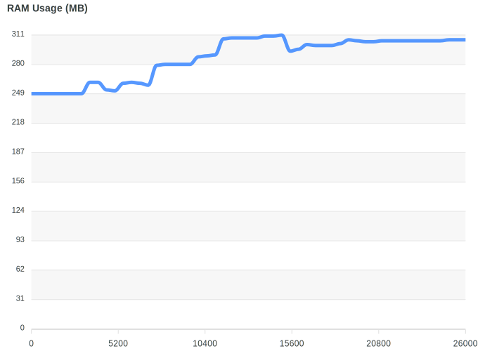

# React Native vs Flutter App Comparison

- [https://medium.com/@shauryasinghal84/measuring-the-performance-of-react-native-apps](https://medium.com/@shauryasinghal84/measuring-the-performance-of-react-native-apps-77741b199ce7)

## Comparison Table (Average over 5 sample Tables below)

| Metric                                         | Flutter IDLE        | Flutter with Interactivity | RN IDLE                                          | RN with Interactivity                              |
| ---------------------------------------------- | :------------------ | :------------------------- | ------------------------------------------------ | -------------------------------------------------- |
| **Average FPS**                                | 59.996              | 50.25                      | 52.34                                            | 43.5                                               |
| **Lowest FPS**                                 | 59.76               | 29.82                      | 48.23                                            | 26.3                                               |
|                                             |                     |
| **Average CPU usage   (all threads)**      | 0.048               | 31.06%                     | 18.52 %                                          | 86.5%                                              |
| **Highest CPU Usage   (all threads)**      | 2.384 %             | 87.37%                     | 48.2 %                                           | 191.16 %                                           |
| **Highest CPU Usage   for UI(/JS) Thread** | 0.398 % (UI Thread) | 64.582%(UI Thread)         | 21.56%(for UI Thread)   4.06%(for JS Thread) | 71.15%(for UI Thread)   113.46%(for JS Thread) |
|                                             |
| **Average RAM Usage**                          | 239.77MB            | 267.476MB                  | 254.2MB                                          | 317.5MB                                            |
| **Highest RAM Usage**                          | 240.8MB             | 274.634                    | 264.8MB                                          | 330.9MB                                            |

## Comparison Table (Sample 1)

| Metric                                         | Flutter IDLE    | Flutter with Interactivity | RN IDLE                                         | RN with Interactivity                           |
| ---------------------------------------------- | :-------------- | :------------------------- | ----------------------------------------------- | ----------------------------------------------- |
| **Average FPS**                                | 59              | 46.49                      | 51.6                                            | 45.6                                            |
| **Lowest FPS**                                 | 22              | 12.10                      | 40                                              | 30                                              |
|                                             |
| **Average CPU usage   (all threads)**      | 14%             | 39.39%                     | 28.4%                                           | 78.9%                                           |
| **Highest CPU Usage   (all threads)**      | 101.1%          | 121.76%                    | 136.9%                                          | 204.3%                                          |
| **Highest CPU Usage   for UI(/JS) Thread** | 63% (UI Thread) | 95.81% (UI Thread)         | 33.3% (for UI Thread)   98% (for JS Thread) | 61% (for UI Thread)   99.6% (for JS Thread) |
|                                             |
| **Average RAM Usage**                          | 274.7MB         | 257.47 MB                  | 210.8MB                                         | 287.1MB                                         |
| **Highest RAM Usage**                          | 275 MB          | 279.54 MB                  | 253MB                                           | 311                                             |

## Comparison Table (Sample 2)

| Metric                                         | Flutter IDLE | Flutter with Interactivity | RN IDLE                               | RN with Interactivity                 |
| ---------------------------------------------- | :----------- | :------------------------- | ------------------------------------- | ------------------------------------- |
| **Average FPS**                                |              | 49.34                      |                                       |                                       |
| **Lowest FPS**                                 |              | 32.34                      |                                       |                                       |
|                                             |
| **Average CPU usage   (all threads)**      |              | 35.93                      |                                       |                                       |
| **Highest CPU Usage   (all threads)**      |              | 90.18                      |                                       |                                       |
| **Highest CPU Usage   for UI(/JS) Thread** | (UI Thread)  | 58.12 (UI Thread)          | (for UI Thread)   (for JS Thread) | (for UI Thread)   (for JS Thread) |
|                                             |
| **Average RAM Usage**                          |              | 268.13                     |                                       |                                       |
| **Highest RAM Usage**                          |              | 271.66                     |                                       |                                       |

## Comparison Table (Sample 3)

| Metric                                         | Flutter IDLE | Flutter with Interactivity | RN IDLE                               | RN with Interactivity                 |
| ---------------------------------------------- | :----------- | :------------------------- | ------------------------------------- | ------------------------------------- |
| **Average FPS**                                |              | 52.20                      |                                       |                                       |
| **Lowest FPS**                                 |              | 36.24                      |                                       |                                       |
|                                             |
| **Average CPU usage   (all threads)**      |              | 25.88                      |                                       |                                       |
| **Highest CPU Usage   (all threads)**      |              | 76.62                      |                                       |                                       |
| **Highest CPU Usage   for UI(/JS) Thread** | (UI Thread)  | 51.08 (UI Thread)          | (for UI Thread)   (for JS Thread) | (for UI Thread)   (for JS Thread) |
|                                             |
| **Average RAM Usage**                          |              | 269.18 MB                  |                                       |                                       |
| **Highest RAM Usage**                          |              | 273.03 MB                  |                                       |                                       |

## Comparison Table (Sample 4)

| Metric                                         | Flutter IDLE | Flutter with Interactivity | RN IDLE                               | RN with Interactivity                 |
| ---------------------------------------------- | :----------- | :------------------------- | ------------------------------------- | ------------------------------------- |
| **Average FPS**                                |              | 51.53                      |                                       |                                       |
| **Lowest FPS**                                 |              | 37.29                      |                                       |                                       |
|                                             |
| **Average CPU usage   (all threads)**      |              | 27.81                      |                                       |                                       |
| **Highest CPU Usage   (all threads)**      |              | 66.13                      |                                       |                                       |
| **Highest CPU Usage   for UI(/JS) Thread** | (UI Thread)  | 55.78 (UI Thread)          | (for UI Thread)   (for JS Thread) | (for UI Thread)   (for JS Thread) |
|                                             |
| **Average RAM Usage**                          |              | 270.35 MB                  |                                       |                                       |
| **Highest RAM Usage**                          |              | 273.16 MB                  |                                       |                                       |

## Comparison Table (Sample 5)

| Metric                                         | Flutter IDLE | Flutter with Interactivity | RN IDLE | RN with Interactivity |
| ---------------------------------------------- | :----------- | :------------------------- | ------- | --------------------- |
| **Average FPS**                                |              | 51.69                      |         |                       |
| **Lowest FPS**                                 |              | 31.14                      |         |                       |
|                                             |
| **Average CPU usage   (all threads)**      |              | 26.32                      |         |                       |
| **Highest CPU Usage   (all threads)**      |              | 82.16                      |         |                       |
| **Highest CPU Usage   for UI(/JS) Thread** |              | 62.12 (UI Thread)          |         |                       |
|                                             |
| **Average RAM Usage**                          |              | 272.25 MB                  |         |                       |
| **Highest RAM Usage**                          |              | 275.78 MB                  |         |                       |

## 🔗 [Flutter IDLE Charts](https://htmlpreview.github.io/?https://github.com/jugshaurya/rn_vs_flutter/blob/main/Flutter%20IDLE/Performance%20Profiler.html)

 

## 🔗 [Flutter With Interactivity Charts](https://htmlpreview.github.io/?https://github.com/jugshaurya/rn_vs_flutter/blob/main/Flutter_interactivity/Performance%20Profiler.html)

 

## 🔗 [RN IDLE Charts](https://htmlpreview.github.io/?https://github.com/jugshaurya/rn_vs_flutter/blob/main/RN_IDLE/Performance%20Profiler.html)

 

## 🔗 [RN With Interactivity Charts](https://htmlpreview.github.io/?https://github.com/jugshaurya/rn_vs_flutter/blob/main/RN_interactivity/Performance%20Profiler.html)

 

## Links

- [x] https://github.com/jugshaurya/measureflutter
- [x] https://github.com/jugshaurya/flutter_app_fn
- [x] https://github.com/jugshaurya/rn_vs_flutter
