# React Native vs Flutter App Comparison

- [https://medium.com/@shauryasinghal84](https://medium.com/@shauryasinghal84/measuring-the-performance-of-react-native-apps-77741b199ce7)

## Comparison Table (Average over 5 sample Tables below)

| Metric                                         | Flutter IDLE       | RN IDLE                                                     | Flutter with Interactivity (Dropdown + Suggestor) | RN with Interactivity (Dropdown + Suggestor)              | Flutter with Interactivity   (only Dropdown) | RN with Interactivity   (only Dropdown)                   |
| ---------------------------------------------- | :----------------- | :---------------------------------------------------------- | ----------------------------------------------------- | ------------------------------------------------------------- | ------------------------------------------------ | ------------------------------------------------------------- |
| **Average FPS**                                | 59.996             | 52.34                                                       | 50.1                                                  | 47.98                                                         | 50.25                                            | 43.5                                                          |
| **Lowest FPS**                                 | 59.76              | 48.23                                                       | 27.98                                                 | 30.3                                                          | 29.82                                            | 26.3                                                          |
| **Average CPU usage   (all threads)**      | 0.048%             | 18.52%                                                      | 31.3%                                                 | 48.9%                                                         | 31.06%                                           | 86.5%                                                         |
| **Highest CPU Usage   (all threads)**      | 2.384%             | 48.2%                                                       | 103.9%                                                | 186.4%                                                        | 87.37%                                           | 191.16%                                                       |
| **Highest CPU Usage   for UI(/JS) Thread** | 0.398% (UI Thread) | 21.56%  (for UI Thread)   4.06% (for JS Thread) | 67.9% (UI Thread)                                     | 64.65% (for UI Thread)   112.98%  (for JS Thread) | 64.582%(UI Thread)                               | 71.15% (for UI Thread)   113.46%  (for JS Thread) |
| **Average RAM Usage**                          | 239.77 MB          | 254.2 MB                                                    | 286.9 MB                                              | 309.58 MB                                                     | 267.476 MB                                       | 317.5 MB                                                      |
| **Highest RAM Usage**                          | 240.8 MB           | 264.8 MB                                                    | 297.4 MB                                              | 315.22 MB                                                     | 274.634 MB                                       | 330.9 MB                                                      |

## Above Table Charts for comparison

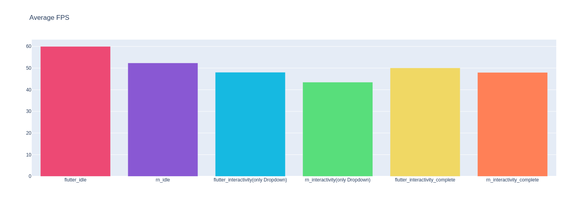

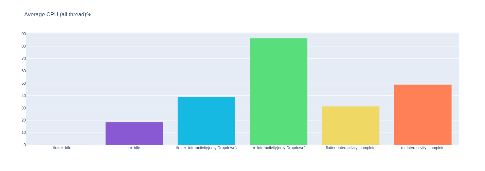

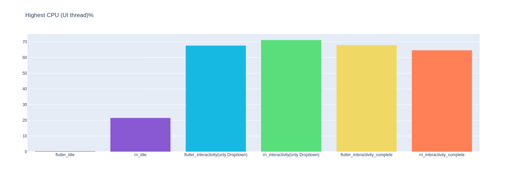
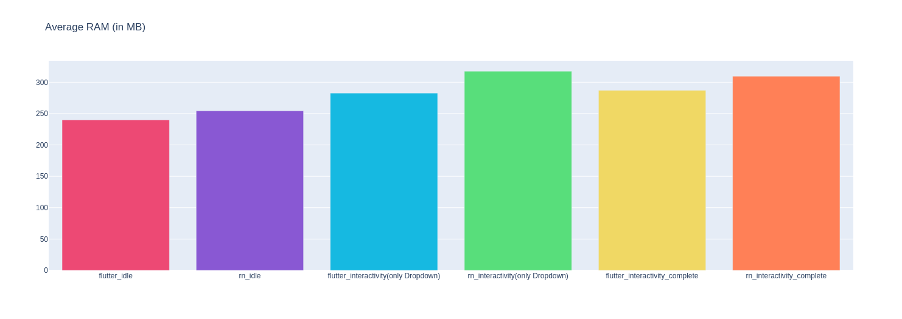
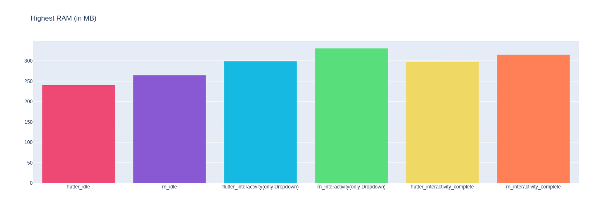
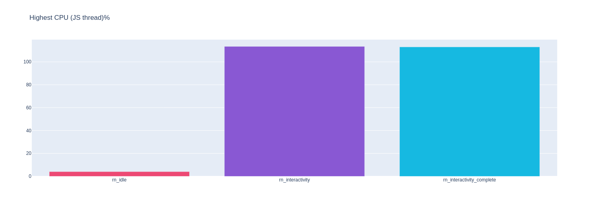

## Flutter IDLE

| Sample | Average FPS | Lowest FPS | Average CPU (all thread)% | Highest CPU (all thread)% | Highest CPU (UI thread)% | Average RAM (in MB) | Highest RAM (in MB) |
| :----- | :---------- | :--------- | :------------------------ | :------------------------ | :----------------------- | :------------------ | :------------------ |
| I      | 60.00       | 60.00      | 0.03                      | 3.96                      | 0.00                     | 242.47              | 245.74              |
| II     | 60.00       | 60.00      | 0.04                      | 1.99                      | 0.00                     | 241.71              | 241.71              |
| III    | 60.00       | 60.00      | 0.05                      | 2.00                      | 0.00                     | 240.51              | 241.70              |
| IV     | 59.98       | 58.80      | 0.08                      | 1.99                      | 1.99                     | 237.31              | 237.93              |
| V      | 60.00       | 60.00      | 0.04                      | 1.98                      | 0.00                     | 236.87              | 236.87              |

## RN IDLE

| Sample | Average FPS | Lowest FPS | Average CPU (all thread)% | Highest CPU (all thread)% | Highest CPU (UI thread)% | Highest CPU (JS thread)% | Average RAM (in MB) | Highest RAM (in MB) |
| :----- | :---------- | :--------- | :------------------------ | :------------------------ | :----------------------- | :----------------------- | :------------------ | :------------------ |
| I      | 52.57       | 40.00      | 27.51                     | 137.45                    | 43.14                    | NaN                      | 213.23              | 254.88              |
| II     | 52.41       | 50.10      | 16.03                     | 23.86                     | 16.49                    | 4.07                     | 272.58              | 273.78              |
| III    | 52.15       | 50.36      | 16.64                     | 24.24                     | 16.06                    | 4.05                     | 268.71              | 271.12              |
| IV     | 52.25       | 50.40      | 16.51                     | 29.59                     | 16.00                    | 4.03                     | 261.35              | 265.38              |
| V      | 52.34       | 50.34      | 15.93                     | 25.90                     | 16.10                    | 4.09                     | 255.25              | 258.80              |

## Flutter Interactivity (only Dropdown)

| Sample | Average FPS | Lowest FPS | Average CPU (all thread)% | Highest CPU (all thread)% | Highest CPU (UI thread)% | Average RAM (in MB) | Highest RAM (in MB) |
| :----- | :---------- | :--------- | :------------------------ | :------------------------ | :----------------------- | :------------------ | :------------------ |
| I      | 46.49       | 12.10      | 39.39                     | 121.76                    | 95.81                    | 257.47              | 279.54              |
| II     | 49.34       | 32.34      | 35.93                     | 90.18                     | 58.12                    | 268.13              | 271.66              |
| III    | 52.20       | 36.24      | 25.88                     | 76.62                     | 51.08                    | 269.18              | 273.03              |
| IV     | 51.53       | 37.29      | 27.81                     | 66.13                     | 55.78                    | 270.35              | 273.16              |
| V      | 51.69       | 31.14      | 26.32                     | 82.16                     | 62.12                    | 272.25              | 275. 78             |

## RN Interactivity (only Dropdown)

| Sample | Average FPS | Lowest FPS | Average CPU (all thread)% | Highest CPU (all thread)% | Highest CPU (UI thread)% | Highest CPU (JS thread)% | Average RAM (in MB) | Highest RAM (in MB) |
| :----- | :---------- | :--------- | :------------------------ | :------------------------ | :----------------------- | :----------------------- | :------------------ | :------------------ |
| I      | 44.89       | 23.39      | 84.52                     | 204.72                    | 70.87                    | 117.53                   | 291.04              | 311.30              |
| II     | 41.90       | 26.40      | 94.00                     | 210.84                    | 75.85                    | 117.53                   | 324.24              | 338.68              |
| III    | 44.07       | 25.27      | 81.86                     | 182.00                    | 71.86                    | 113.77                   | 334.76              | 348.44              |
| IV     | 42.77       | 27.66      | 92.21                     | 183.63                    | 67.86                    | 111.33                   | 318.40              | 327.29              |
| V      | 43.73       | 28.86      | 79.93                     | 174.60                    | 69.31                    | 107.14                   | 319.16              | 328.86              |

## Flutter Interactivity (Dropdown + Suggestor)

| Sample | Average FPS | Lowest FPS | Average CPU (all thread)% | Highest CPU (all thread)% | Highest CPU (UI thread)% | Average RAM (in MB) | Highest RAM (in MB) |
| :----- | :---------- | :--------- | :------------------------ | :------------------------ | :----------------------- | :------------------ | :------------------ |
| I      | 47.22       | 18.00      | 37.35                     | 152.00                    | 88.00                    | 272.06              | 287.31              |
| II     | 50.89       | 25.06      | 30.41                     | 116.47                    | 70.28                    | 287.70              | 305.64              |
| III    | 50.00       | 30.18      | 31.26                     | 85.49                     | 59.64                    | 288.54              | 295.28              |
| IV     | 50.79       | 34.75      | 29.20                     | 80.16                     | 56.53                    | 292.60              | 296.43              |
| V      | 51.42       | 31.89      | 28.41                     | 85.54                     | 65.17                    | 293.61              | 302.45              |

## RN Interactivity (Dropdown + Suggestor)

| Sample | Average FPS | Lowest FPS | Average CPU (all thread)% | Highest CPU (all thread)% | Highest CPU (UI thread)% | Highest CPU (JS thread)% | Average RAM (in MB) | Highest RAM (in MB) |
| :----- | :---------- | :--------- | :------------------------ | :------------------------ | :----------------------- | :----------------------- | :------------------ | :------------------ |
| I      | 47.47       | 24.85      | 49.98                     | 205.23                    | 76.46                    | 116.70                   | 300.30              | 309.57              |
| II     | 48.74       | 37.47      | 44.81                     | 155.07                    | 51.49                    | 105.37                   | 309.46              | 314.95              |
| III    | 48.36       | 26.33      | 45.60                     | 192.38                    | 74.15                    | 110.22                   | 310.09              | 313.59              |
| IV     | 47.70       | 32.51      | 52.33                     | 201.20                    | 59.76                    | 111.55                   | 309.45              | 313.68              |
| V      | 47.62       | 30.30      | 52.06                     | 178.36                    | 61.39                    | 121.09                   | 318.61              | 324.31              |

## Charts generated by flashlight

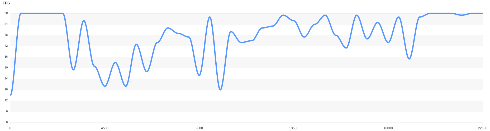
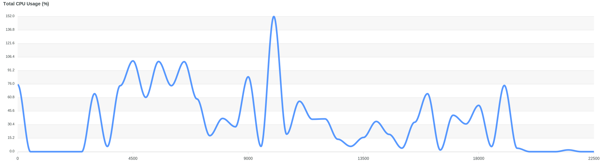
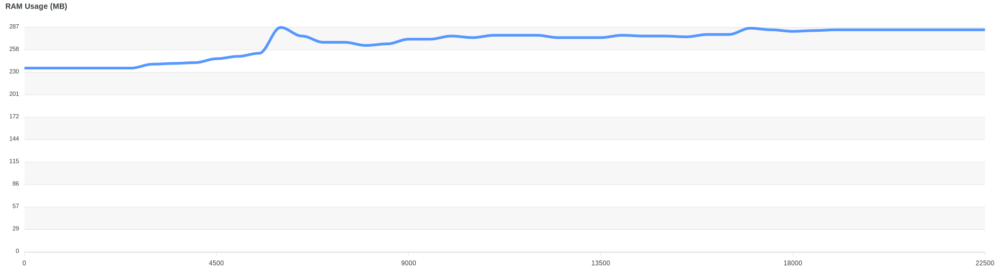

## Links

- [x] https://github.com/jugshaurya/measureflutter
- [x] https://github.com/jugshaurya/flutter_app_fn
- [x] https://github.com/jugshaurya/rn_vs_flutter
- [x] https://colab.research.google.com/drive/1h6sxksOplZwUpmTKiU1CDPkucgEv0VBG#scrollTo=TALbtKxNOWLc
